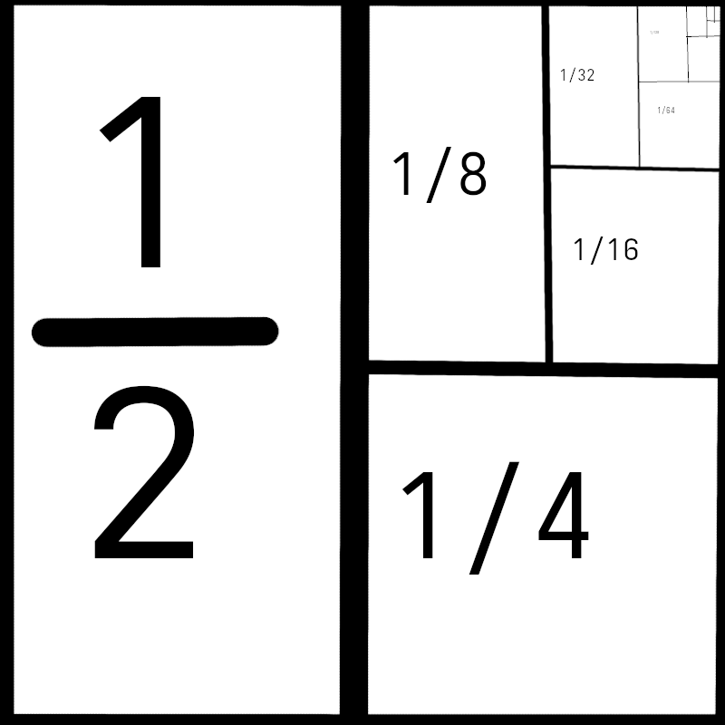

Finance of Cryptocurrency
======================

Questions that will be answered here.

What determines the market cap of a cryptocurrency?
What effect do mining, burning, and tx fees have on it?

But first...

Geometric series
================

[Geometric series](https://en.wikipedia.org/wiki/Geometric_series) are a list of numbers we want to sum up, where each number relates to the next by a constant factor.
If the constant factor is less than 1, then the series converges to a limit.

For example 1/2 + 1/4 + 1/8 + 1/16 ... = 1.

I can prove it geometrically:

Convergent geometric series have a total = (first element) * (1/(constant factor))
In our example above, the first number was (1/2), the constant factor was (1/2), so the total must be 1.

What does this have to do with the price of a cryptocurrency?

The Goose with Golden Eggs
==================

You have a goose that lays valuable golden eggs.
How many golden eggs would someone need to pay you to convince you to sell them your goose?

For this example, the risk free interest rate is 4% and the goose lays one egg per year.

The goose is worth as much as all of the eggs it will produce, but, this year's egg is worth 4% more to us than next year's egg. Because you can invest this year's egg and earn 4% interest.
Similarly, next year's egg is worth 4% more than the egg that will be layed 2 years in the future.

It is a geometric series!

The goose is worth (1 egg) + (0.96 egg) + (0.96^2 egg) + ...
according to our formula, this is the same thing as (1 egg) / (1-0.96), which is 25 eggs.

So, the golden goose is worth as much as 25 of its golden eggs.

This way of measuring the value of the goose is called [Discounted Cash Flow](https://en.wikipedia.org/wiki/Discounted_cash_flow).

Burning
===============

Burning some coins is equivalent to distributing those coins to all other holders of that kind of coin.
If you destroy 1/nth of the coins, then each coin becomes n/n-1 times more valuable. 

Mining
==============

Mining for block rewards is a process of converting value from electricity format into cryptocurrency format. It has the effect of increasing the total number of coins, without changing the price of an individual coin.

Transaction Fees
=============

A transaction fee for an amount of currency X is the same thing as burning X and having the miners receive a block reward of X.

Calculating the intrinsic value of a cryptocurrency
================

Calculating the intrinsic value of a cryptocurrency is done using the same Discounted Cash Flow strategy like we used for the golden goose.

The interest rate is currently about 5%.

(Market cap) = (0.95^0 * (Fees paid and coins burned this year)) + (0.95^1 * (Fees paid and coins burned next year)) + (0.95^2 * (Fees paid and coins burned in the year 2 years in the future)) + ...

If the amount of coins and fees stays relatively stable per year as C, then
(Market Cap) = C/0.05 = 20*C.
The Market cap is about 20 fold bigger than the amount of fees and burns in a year.

What does this mean to cryptocurrency today in 2026?
===============

None of the existing cryptocurrencies have remotely enough fees or burns. Bitcoin would need to have 1000-fold more fees. Ethereum would need 25-fold more fees.

If cryptocurrency doesn't find a way to vastly increase the fees or burns, then it will fail.

